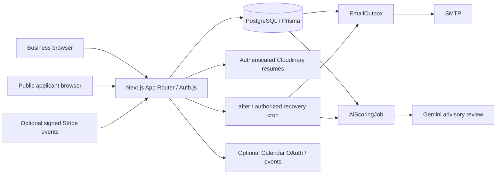

# HireKarlo architecture

Current local source, 17 September 2026. Historical prototype descriptions are not the current security specification. HireKarlo is a lightweight business ATS for recruitment agencies and company hiring teams in India and international markets. Candidates apply without business accounts; the product charges workspaces, not applicants.

## System and frontend

React 19 and Next.js 16 App Router divide server data loading/actions from interactive forms/pools/pipeline components. Shared UI primitives, React Hook Form/Zod and Sonner provide inputs/feedback. Dashboard layout verifies server access and supplies the session to client navigation. Pools load bounded pages; the pipeline shows 100 applicants per page with explicit navigation/page-local stage counts. Public marketing/legal/auth/applicant pages use their own layouts and forms. Consent-based analytics is restricted to marketing paths and sanitized before sending. Frontend/backend run in one service, not separately started applications.

## Backend and boundaries

Server actions orchestrate validated business commands; route handlers implement auth, uploads, signed downloads, webhook/cron protocols and core readiness. Helpers own context, roles, entitlements, provider requests, document parsing, templates and durable workers. `requireAuth` checks persisted session version; `requireOrg` checks current membership/workspace selection. Proxy navigation checks never replace server authorization. Hiring roles use tenant-scoped queries; interviewers access only authorized assigned work. Owner/admin privileges differ from owner-only billing.

Prisma 7.10 uses the pg adapter and a bounded pool (default five connections). PostgreSQL transactions serialize quota writes through organization locks, schedule conflicts through organization/application locks and OTP guesses through challenge locks. New owner/creator FKs restrict user deletion to preserve tenant hiring/audit records. Schema field and operational detail is in `database.md`.

## Main flows

1. **Business signup:** validate/cap password bytes and email; enforce pilot/request policy; atomically create user, workspace, membership, verification token and email intent. Deferred SMTP delivery retries from the persisted queue. Verification consumes its token once; credentials require verified account. Reset consumes a scoped token and increments session version in one transaction.
2. **Applicant intake:** queue email challenge; upload requires its valid live code plus eligible open job. Validate bytes/size/DOCX expansion before private Cloudinary storage; persist expiring upload claim. Submission locks plan/challenge state, enforces tenant candidate capacity/deduplication, claims upload and writes candidate/application/privacy acknowledgement plus optional AI job atomically. Intake succeeds before provider scoring starts.
3. **AI review:** `after` attempts the persisted job. A UUID lease token fences stale workers; quota is reserved for each actual provider attempt. Text is size-bounded and structured output validated. Owned completion atomically records score/summary; transient failures back off, permanent text/allowance errors or three attempts become failed jobs. Recovery cron checks one job per invocation. It never automatically changes a hiring stage. UI can refresh/requeue deliberately.
4. **Pipeline/interview:** stage change locks fresh application state and couples audit/notification intent. Schedule serializes conflict check and reservation, rejects terminal applications, and commits stage/audit/outbox before best-effort Google calls. Cancellation preserves a fresh terminal stage and suppresses pending schedule email; it queues cancellation atomically. Candidate experience links are single-use and stored separately from reviewer ratings.
5. **Team/clients:** invitation seats and notification intents are serialized; acceptance requires matching signed-in email/current invite and plan rules. Membership removal revokes organization access. Clients/jobs must share the active tenant.
6. **Optional billing:** owner-only checkout verifies configured server prices and pending sessions. Signed, idempotent webhooks retrieve current provider state under organization update serialization; redirects/event metadata alone do not grant entitlements. Past-due/expired plans deny paid capacities. No merchant/payment provider is currently activated.

## Decisions and tradeoffs

- Keep the existing modular Next.js monolith rather than add microservices/infrastructure cost. It is appropriate for the preview and small pilots; actions still combine some orchestration and could be separated when complexity warrants.
- Reuse PostgreSQL for shared rate limits, quotas and durable queues. This avoids a new Redis/queue bill and works across instances, with locking/connection contention to monitor.
- Commit application/notification intent before external services. Jobs survive function interruption, but delivery is at least once; SMTP acceptance followed by a crash can duplicate an email. Provider calls are not fully idempotent distributed transactions.
- Keep Calendar best effort after authoritative reservation; durable event reconciliation is deferred. New scoring is durable but parser CPU/malware isolation is not solved by a queue.
- Use membership-scoped application authorization; RLS/SSO/MFA expansion is deferred. Add regression checks whenever a new tenant query is introduced.
- Generate Prisma in builds and migrate explicitly. Never let a preview/build silently mutate the customer database.
- Retain daily Hobby preview crons because the owner has no upgrade budget. Fast automatic recovery/paid-service SLAs require suitable commercial hosting; the separate frequent-cron template is not active.

## Limits and operations

Pool/projection/pagination reduce routine resource usage, but no load/bundle/heap benchmark was collected. Large CSV exports still allocate the full tenant result. New uploads are private; old public storage and plaintext calendar tokens require inventory/migration. Core health checks DB/config only; real provider tests, alerts, backups, privacy/legal arrangements and payment reconciliation remain external release gates. See `security.md`, `deployment.md` and `FINAL-CTO-REVIEW.md` for evidence and unresolved work.
